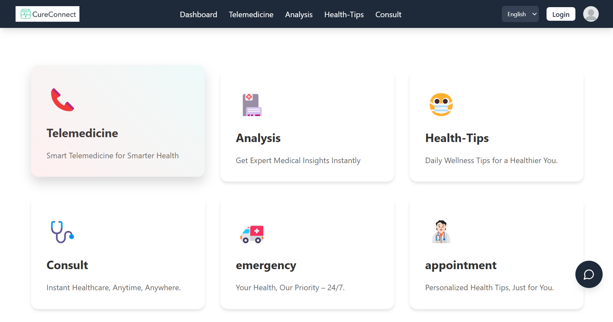
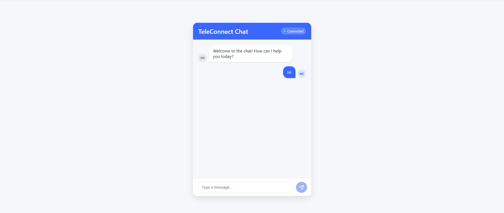
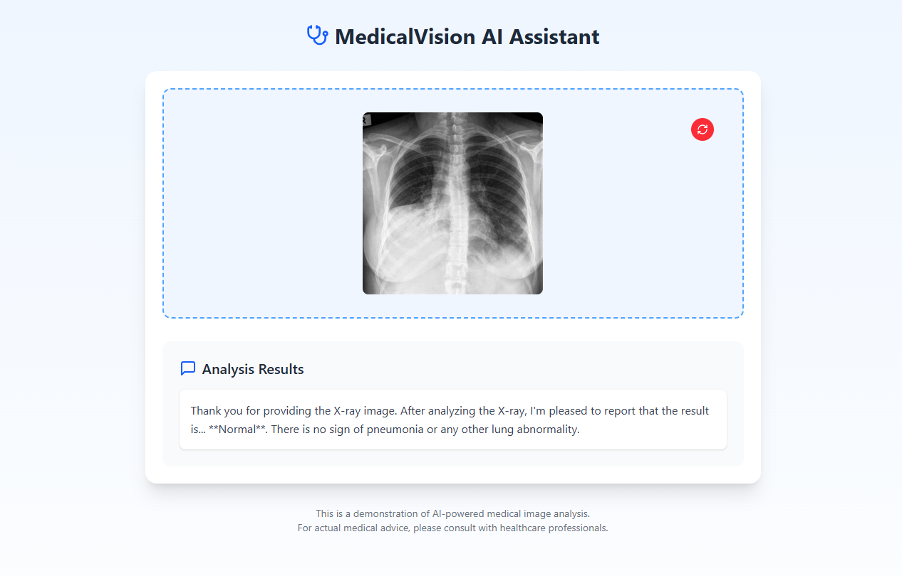
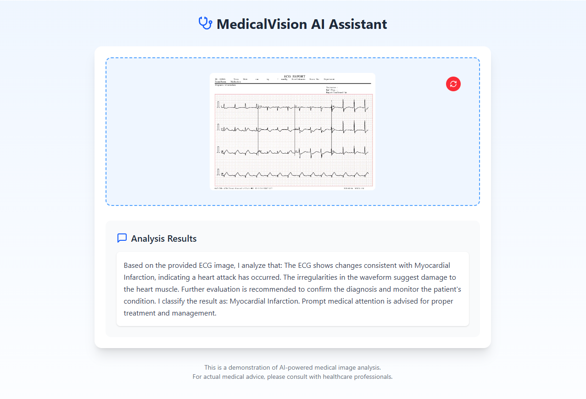
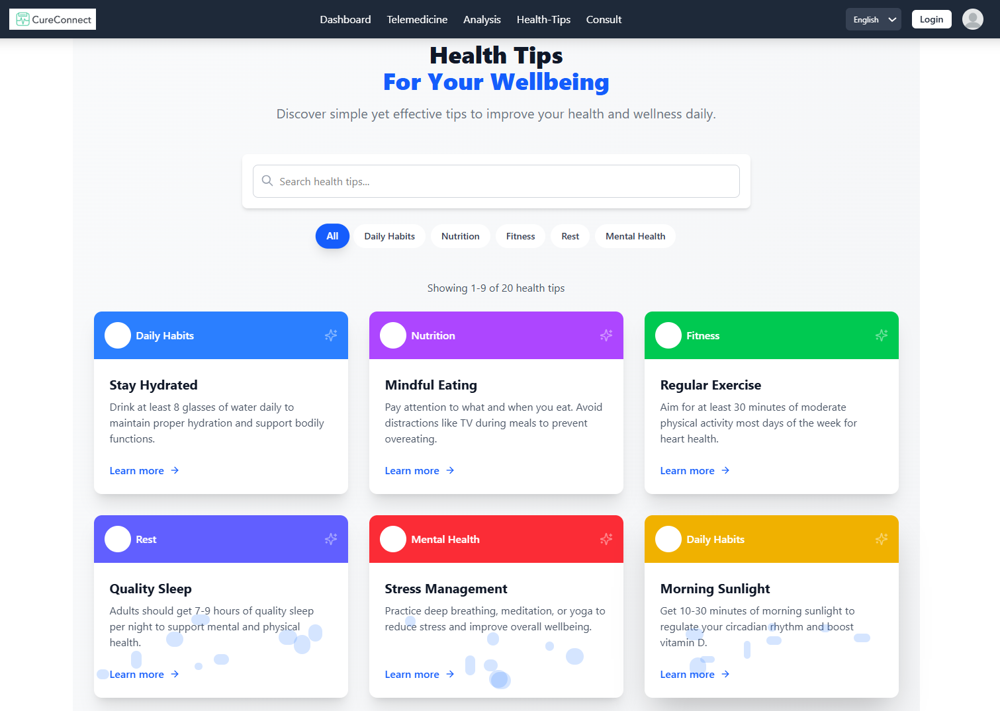
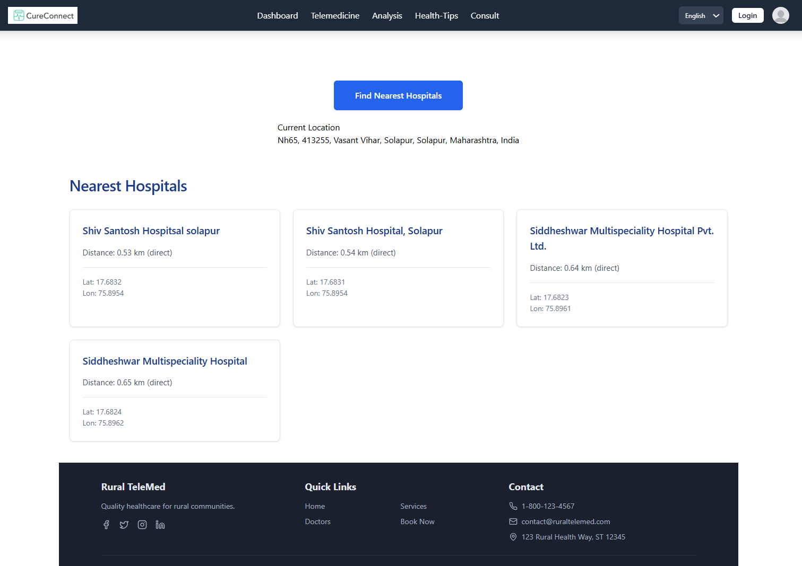
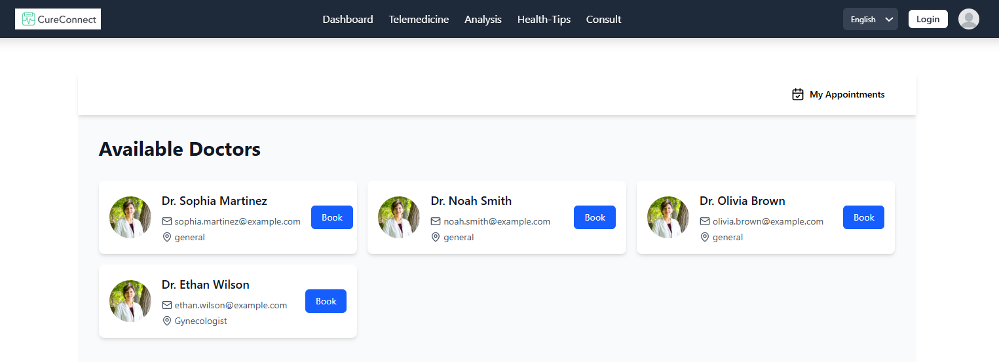
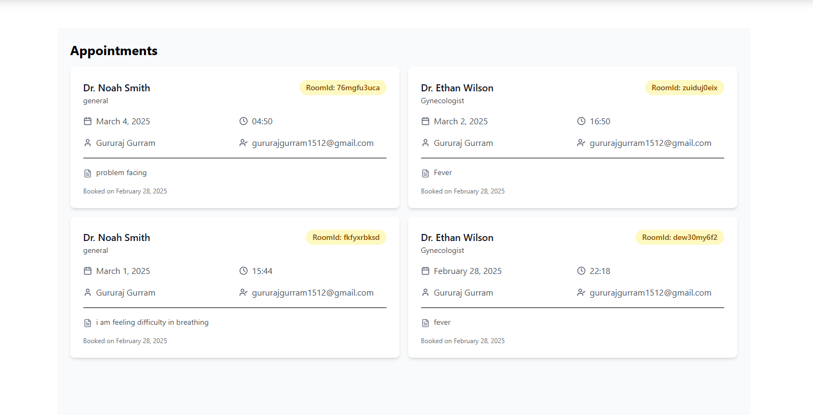

# MediConnect - Advanced Telemedicine Platform

## About MediConnect

MediConnect is a comprehensive telemedicine platform designed to bridge the gap between patients and healthcare providers. Our platform offers a seamless, secure, and efficient way to access quality healthcare services from the comfort of your home.

## Our Features

### 1. Virtual Consultations

- **HD Video Conferencing**: Crystal clear video and audio quality for effective doctor-patient communication
- **Low Bandwidth**: The foundation of video-calling lies in WebRTC which operates on low-bandwidth
- **Prescription Management**: Receive digital prescriptions directly after consultation
- **Consultation History**: Access records of all your past consultations

### 2. Secure Messaging System

- **End-to-End Encryption**: Your conversations remain private and secure
- **Quick Responses**: Get answers to simple queries without scheduling a full consultation
- **Low Bandwidth**: The foundation of video-calling lies in WebRTC which operates on low-bandwidth

### 3. Advanced Medical Analysis

- **ECG Analysis**: Upload and receive professional interpretation of your ECG reports
- **X-ray Interpretation**: Get expert analysis of X-rays with detailed reports
- **AI-Assisted Diagnostics**: Preliminary analysis using cutting-edge AI technology
- **Specialist Referrals**: Connect with specialists based on your analysis results
- **Secure Storage**: All your medical images and reports stored securely for easy access

### 4. Personalized Health Tips

- **Daily Health Insights**: Receive personalized health tips based on your medical history
- **Nutrition Guidance**: Get customized dietary recommendations
- **Exercise Plans**: Access workout routines tailored to your health condition
- **Medication Reminders**: Never miss a dose with our smart reminder system
- **Wellness Articles**: Read expert-written articles on various health topics

### 5. Emergency Hospital Locator

- **Real-time Hospital Mapping**: Find the nearest hospitals in case of emergencies
- **Ambulance Services**: Quick access to ambulance contact information
- **Wait Time Indicators**: See estimated wait times at different emergency rooms
- **Specialty Filters**: Find hospitals based on specific medical specialties
- **Route Navigation**: Get directions to the hospital of your choice

### 6. Comprehensive Appointment Dashboard

- **Intuitive Calendar Interface**: Easily schedule, reschedule, or cancel appointments
- **Availability Checker**: See real-time availability of healthcare providers
- **Appointment Reminders**: Get notifications before your scheduled appointments
- **Payment Integration**: Pay for consultations directly through the platform
- **Follow-up Scheduling**: Easily book follow-up appointments as recommended by your doctor

## Why Choose MediConnect?

- **Accessibility**: Healthcare services available 24/7, regardless of your location
- **Affordability**: Reduce costs associated with in-person visits
- **Efficiency**: Save time with quick access to healthcare professionals
- **Comprehensive Care**: All your healthcare needs addressed on a single platform
- **Data Security**: Your medical information is protected with state-of-the-art security measures.

## Get Started Today

Join thousands of satisfied users who have made MediConnect their preferred healthcare platform. Sign up now and take the first step towards convenient, efficient, and quality healthcare.

---

© 2025 MediConnect. All rights reserved.
